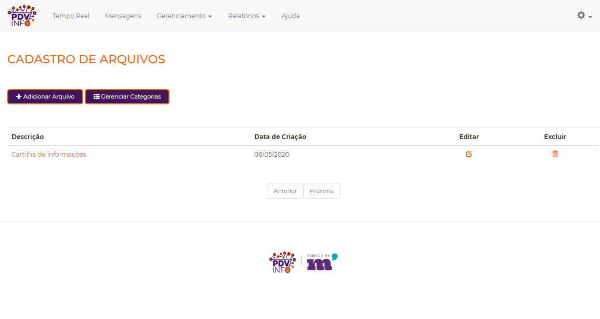
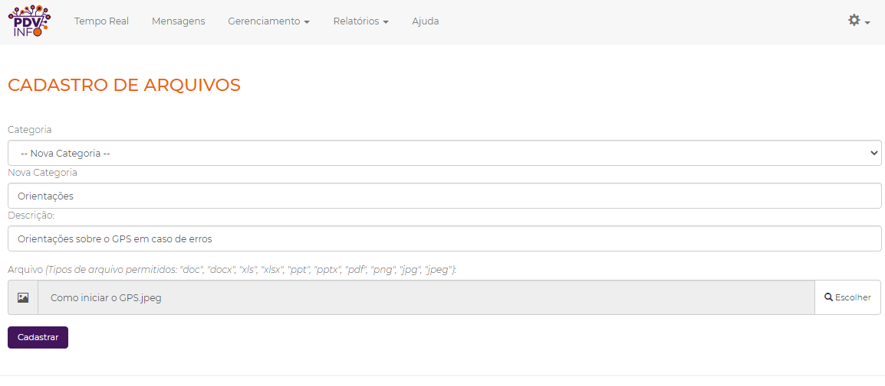

### 1. Introdução:

Os Arquivos, como o nome diz, são arquivos que podem ser cadastrados para serem baixados pelos colaboradores através do app 
(para o colaborador baixar o arquivo, basta estar conectado a internet e ir na aba arquivos na página inicial do app), 
esses arquivos podem ser usados como orientações, como avisos, ou até mesmo como informações sobre novidades.

### 2. Cadastro dos arquivos:

Para entrar na zona de gerenciamento de arquivos vá em **Gerenciamento > Arquivos**.

Para Cadastrar um arquivo basta clicar em **Adicionar Arquivo**, ao clicar vai abrir a aba de cadastro de arquivos, onde será necessário selecionar a categoria
(caso não possua uma basta selecionar nova categoria e digitar no nome da categoria no nome abaixo), preencher o campo de descrição do arquivo e por último
clicar em escolher para selecionar o arquivo em seu computador (os arquivos pode ser dos seguinte tipos: "doc", "docx", "xls", "xlsx", "ppt", "pptx", "pdf", "png", "jpg", "jpeg")

