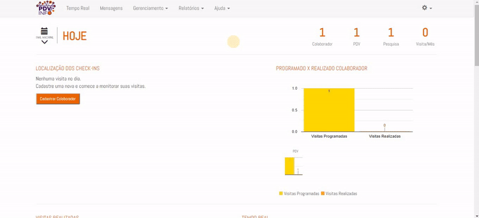

### 1. O que é:

A carteira é uma funcionalidade do painel para atribuir PDV's à um colaborador. Parecido com um roteiro, porém todos os pontos que
estiverem cadastrados na carteira serão disponibilizados ao colaborador, diferente do roteiro, que aponta os pontos de acordo com um
calendário.

O objetivo da carteira é flexibilizar as visitas quando necessário. Quando a prioridade não for ter um calenário de visitas, a utilização da carteira é recomendada. 

#### 2. Criando uma Carteira

A configuração de uma carteira é mais simples que a de roteiro. Em **Gerenciamento > Carteira**, são adicionados os PDV's cadastrados no painel à carteira do promotor.

#### 3. Importação em Lotes

Para facilitar a criação de uma carteira, existe a opção de importação em lotes, que facilita muito quando o volume de PDV 
à ser adicionado é grande. 

Siga para a página de (importação de lotes na carteira)[../gerenciamento/carteira.md] para entender o processo.