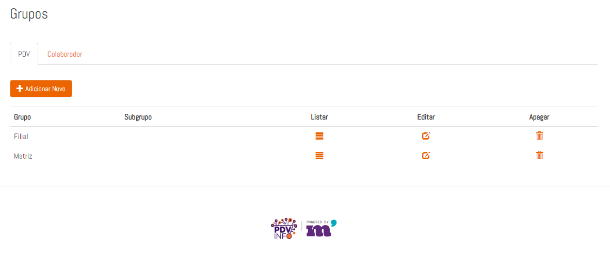
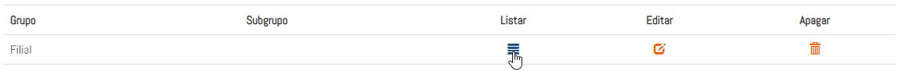

### 1. Introdução

Os grupos são uma forma de ogranizar pesquisas e limitar elas à um grupo de PDV's ou Colaboradores. Com os grupos, o gereciamento de grandes equipes, ou uma grande quantidade de produtos diferentes fica muito mais fácil. 

Os grupos por exemplo, podem dividir redes de lojas. As diferentes redes de lojas podem conter produtos diferentes, assim, precisando que nesses pontos as pesquisas sejam diferentes.

#### 1.1 Configurando um Novo Grupo

Para criar um Grupo de PDV basta clicar em ** Adicionar Novo ** e cadastrar o grupo.

Com o Grupo cadastrado, você pode gerenciar quais PDV's farão parte desse grupo agora. Basta clicar ícone ** Listar **: 

Nessa página, todos os PDV's cadastrados serão listados, selecione os que farão parte desse grupo e clique em adicionar.

#### 1.2 Grupo de Colaboradores

A configuração para um grupo de colaboradores é a mesma que para o grupo de PDV. Um grupo de colaboradores controla se a pesquisa aparece para eles ou não. Portanto, se dois tipos diferentes de colaboradores visitam um PDV
(Um revendedor e um promotor por exemplo) as pesquisas deles podem ser diferentes.
Com o grupo de colaboradores, esse controle pode ser feito. A pesquisa que o revendedor vai receber em seu smartphone vai conter perguntas diferentes que a do promotor.

### 2. Utilização do Grupo de PDV e Grupo de Colaborador

Com um grupo cadastrado no painel e configurado, agora as pesquisas podem ser configuradas para eles. Em ** Gerenciamento > Pesquisa ** clique em Configurar para editar uma pesquisa. Agora, as opções de grupos estão disponíveis.

