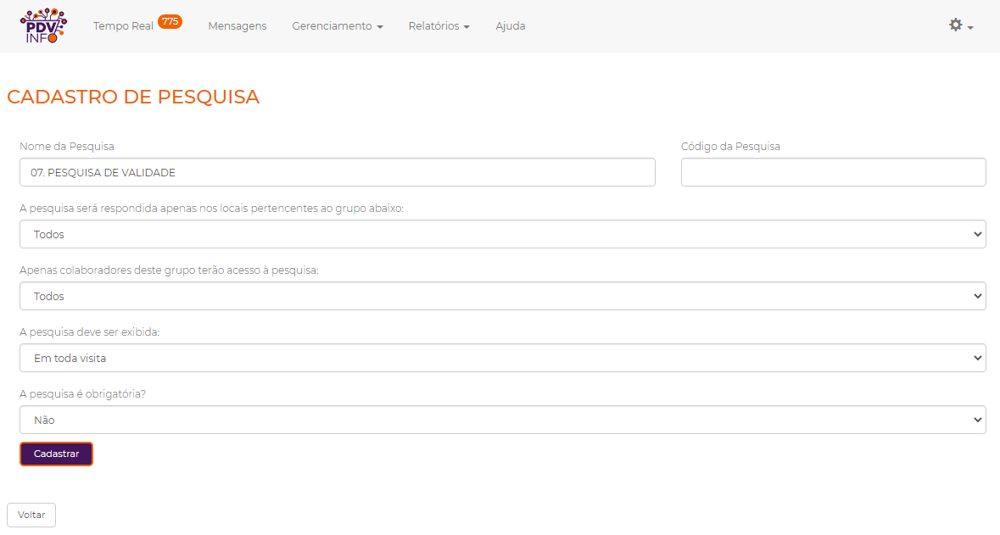
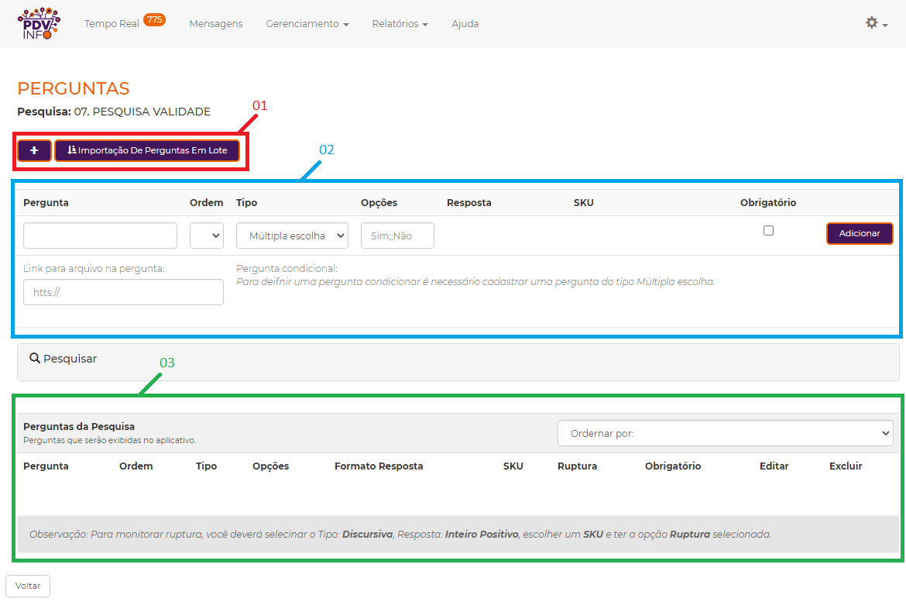

### 1. Introdução:

As pesquisas são como o check-list que os colaboradores vão realizar ao chegar nos PDVs,
então dentro das pesquisas ficarão as perguntas que precisam ser respondidas pelo colaborador como a quantidade de um produto na loja, a validade e etc,
por isso elas são a parte mais importante no setup do painel, para gerenciar as pesquisas basta ir em **gerenciamento > pesquisa**. 
Nesta área, você poderá **criar uma nova pesquisa**, **criar uma lista dinâmica**, ou utilizar um dos **modelos de pesquisa** predefinido para configurar sua própria pesquisa.

### 2. Criar uma nova pesquisa:

Para criar uma nova pesquisa basta clicar em **criar nova pesquisa**, após isso você será redirecionado para página de criação de pesquisa, nesta página você poderá inserir:
* `Nome da pesquisa` - O nome da pesquisa, caso deseje ordená-las pode colocar o número da ordem da pesquisa no nome (por exemplo 01, 02, como na foto acima).
* `Código da pesquisa` - O código da pesquisa, tem a mesma funcionalidade do código de PDVs, que serve justamente como um identificador da pesquisa, para que possa ser utilizado no seu próprio sistema, através da nossa API.
* `A pesquisa será respondida apenas nos locais pertencentes ao grupo abaixo` - Está parte serve para selecionar os grupos de PDVs que servem para que você possa limitar para quais lojas essa pesquisa vai aparecer, caso tenha uma pesquisa que deseje que seja respondida apenas nas lojas de uma rede específica, pode criar um grupo de PDVs e colocá-lo na pesquisa.
* `Apenas colaboradores deste grupo terão acesso à pesquisa` - Esta parte serve para selecionar os grupos de colaboradores que tem uma funcionalidade similar aos grupo de PDVs, porém limita para que apenas os colaboradores daquele grupo possam responder está pesquisa.
* `A pesquisa deve ser exibida` - Esta é a frequência que a pesquisa vai aparecer para o colaborador, caso deseje que o colaborador realize esta pesquisa a cada 5 visitas na loja, pode configurar a frequência para **A cada 5 visitas**. (funcionalidade ainda em período de testes e indisponível na play store)
* `A pesquisa é obrigatória?` - E por último se a pesquisa vai ser obrigatória ou não, as pesquisas obrigatórias precisam ser respondidas pelo colaborador para que ele possa realizar o check-out da loja.

### 3. Criar perguntas da pesquisa:

Após criar a pesquisa é a hora de configurar suas perguntas, para isso basta clicar no nome da pesquisa ou basta clicar no ícone das perguntas,
então você será redirecionado para a página de cadastro de perguntas.

Na parte circulada em vermelho, você poderá criar novas perguntas pela importação em lotes, ou pelo botão com o **+**,
caso esteja editando uma pergunta deverá clicar neste botão para limpar os campos de criação de pergunta (retângulo azul 02),
na zona de criação de perguntas você poderá digitar o nome da pergunta, selecionar a ordem (se ela é a primeira, ou a segunda e etc), o tipo da pergunta:

#### 3.1. Tipos de perguntas:

* `Múltipla Escolha` - Será apresentado ao colaborador várias opções de resposta, podendo selecionar uma delas para responder à pergunta. As opções são dadas no campo Opções separado por " ;; " (Dois ponto e vírgula).
* `Discursiva` - O colaborador insere os dados por meio do teclado. Estes dados podem ser filtrados pelo tipo de resposta.
* `Upload de Imagem` - Será aberta a câmera do dispositivo, possibilitando a captura de uma imagem. Só imagens tiradas naquele instante serão aceitas, ou seja, não é possível enviar fotos da galeria.
* `Lista Dinâmica` - Uma versão da múltipla escolha que suporta muito mais itens.
* `Assinatura` - Um campo onde poderá ser coletado a assinatura de uma pessoa.
* `Qr code / Código de barras` - Uma pergunta com um leitor de código de barras e de Qr code.
* `Múltipla Resposta` - Uma versão da múltipla escolha, onde poderá ser selecionado mais de um item de uma vez.
* `Geolocalização` - Uma pergunta que coleta a localização atual do colaborador quando a pergunta foi respondida.

Caso selecione uma pergunta do tipo **múltipla escolha**, **múltipla resposta** ou **lista dinâmica**, você terá disponível o campo opção, nele você poderá digitar as opções da pergunta **múltipla escolha** ou **múltipla resposta** separando as opções por “;;” (dois ponto e vírgula), você poderá também selecionar uma das listas criadas caso a pergunta seja do tipo **lista dinâmica**. Caso selecione uma pergunta do tipo **Discursiva** você terá a opção de selecionar o **SKU** e também do tipo de resposta:

#### 3.2. Tipos de respostas:

* `Texto` - O teclado do dispositivo será aberto possibilitando a entrada de dados do tipo texto.
* `Inteiro Positivo` - Um teclado numérico será aberto para inserir números inteiros. Quantidade de estoque por exemplo, é verificada com esse tipo de resposta, nesta pergunta você poderá selecionar se ela terá rupturas, caso esta opção seja selecionada toda vez que esta pergunta for respondida como zero será registrado uma ruptura no relatório de rupturas.
* `Decimal Positivo` - Entrada de números decimais, utilizada por exemplo para preço de um determinado produto.
* `Data` - O teclado numérico do dispositivo será aberto e os números serão automaticamente formatados da seguinte forma DD/MM/AAAA, (D = dia, M = mês, A = ano).
* `Hora` - Um campo da mesma forma que a data, mas formatado da seguinte forma HH:MM:SS (H = hora, M = minutos, S = segundos).
* `Telefone` - Um campo da mesma forma que os campo de data e hora.
* `E-Mail` - Um campo similar ao de texto onde poderá ser digitado um email.
* `Inteiro Negativo` - similar ao inteiro positivo mas com a possibilidade de digitar números negativos, devido a isso não é possível configurá-lo com ruptura.
* `Decimal negativo` - similar ao decimal positivo mas com a possibilidade de digitar números negativos.
 
Obs: Todos os campos de inserção de números, como inteiro e decimal, pode-se definir um range, onde o colaborador só poderá inserir números dentro do range,
maior que o mínimo e menor que o máximo.
