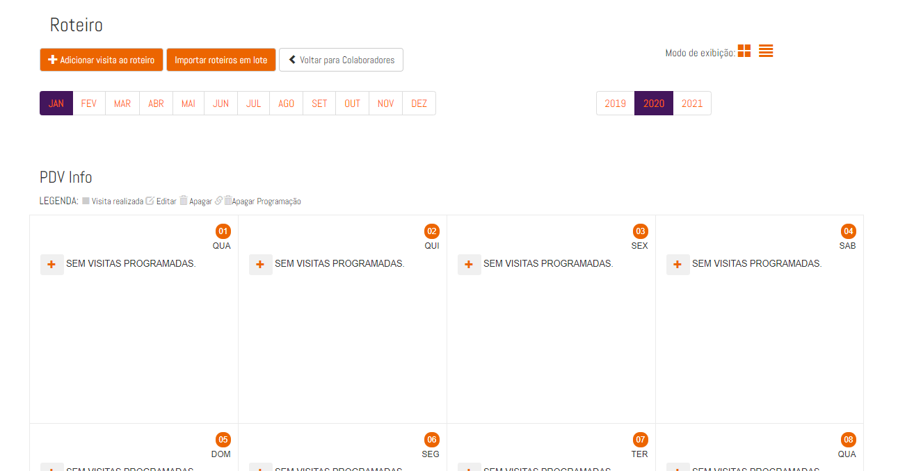
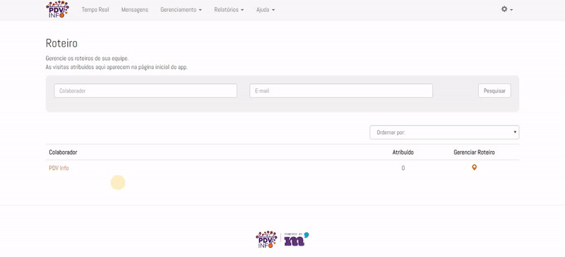

### 1. Introdução

O roteiro ou carteira é como os PDV's são relacionados ao colaborador. A diferença entre um roteiro e a carteira é que o roteiro tem como objetivo seguir um calendário de visitas, que podem ser configuradas em vários períodos de repetição. Já na carteira, os PDV's ficam atribuídos ao colaborador, que pode acessar e realizar suas visitas através da função "Buscar" no App.

#### 2. Configuração de Roteiro

Em **Gerenciamento > Roteiro** ficam dispostos os colaboradores cadastrados. Clicando no colaborador que 
terá um roteiro cadastrado leva à pagina com o calendário do mês:

 
 
Em **adicionar visita ao roteiro**, a visita pode ser cadastrada:
 

Selecione um PDV e configure o período.

#### 3. Períodos de repetição da visita

* `Visita Única` - Será uma visita ao PDV que só será feita em um dia.
* `Diária` - Esta visita se repetirá todos os dias da semana durante um período selecionado. Podem ser adicionados sábados e domingos.
* `Semanal` - É um roteiro que se repete baseado nos dias da semana dentro de um período.
* `A cada 2 semanas` - A cada duas semanas, esse roteiro se repete. Por exemplo: Ao selecionar uma segunda-feira num mês, em 15 dias (Próxima segunda-feira em duas semanas) a visita será disponibilizada ao colaborador.
* `A cada 3 semanas` - A cada três semanas, esse roteiro se repete. Por exemplo: Ao selecionar uma segunda-feira num mês, em 22 dias (Próxima segunda-feira em três semanas) a visita será disponibilizada ao
colaborador.  
* `Mensal` - Todo mês, a visita vai se repetir no dia especificado.
* `Bimestral` - A cada dois meses, a visita vai se repetir no dia especificado.
* `Trimestral` - A cada três meses, a visita vai se repetir no dia especificado.
* `Semestral` - A cada seis meses, a visita vai se repetir no dia especificado.      
* `Anual` - A visita será realizada por ano.

#### 4. Exemplo de um Roteiro

O colaborador fará uma visitação semanal todas as segundas, quartas, sextas e sábados em um PDV.
Para isso, vamos utilizar o tipo de visita semanal. Marcar os dias da semana e selecionar um período.

