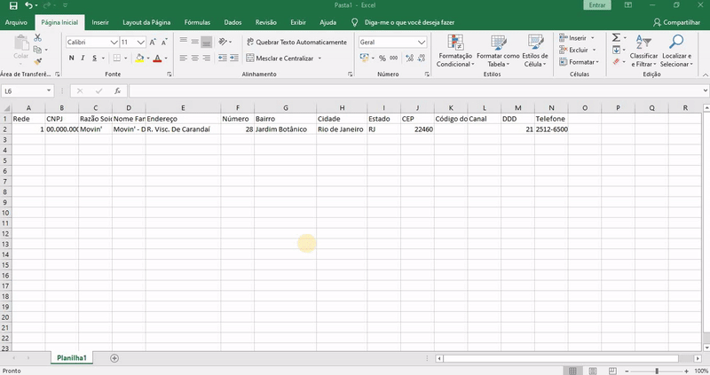

[comment]: <> (copy and paste de salvar como csv separado por virgulas)

#### 2. Salvar como CSV e Importar no Painel

Para importar os dados no painel é necessário salvar a planilha como CSV (Separado por Vírgulas) no Excel.
CSV é um formato de texto que separa as colunas e linhas por ";" (Ponto e Vírgula). O Excel tem suporte
para esse formato, para salvar como CSV siga os passos:

##### 3. Exportar como CSV

No Excel, clique em **Arquivo > Salvar Como**. Nomeie o seu arquivo e como formato, utilize **CSV (Separado por Vírgulas)**

##### 4. Importar no Painel

Em ** Gerenciamento > SKU ** Selecione a opção importar em lotes e envie sua planilha CSV.

