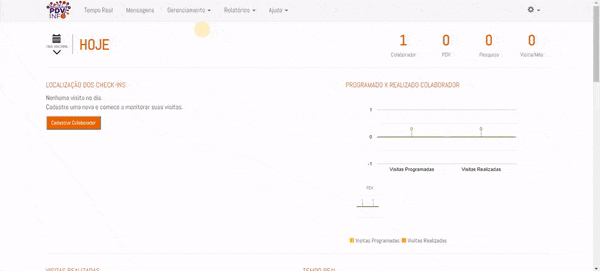
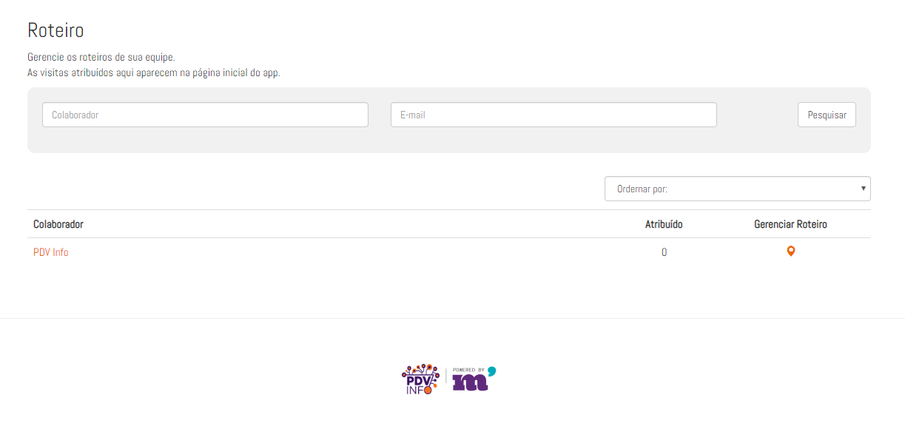
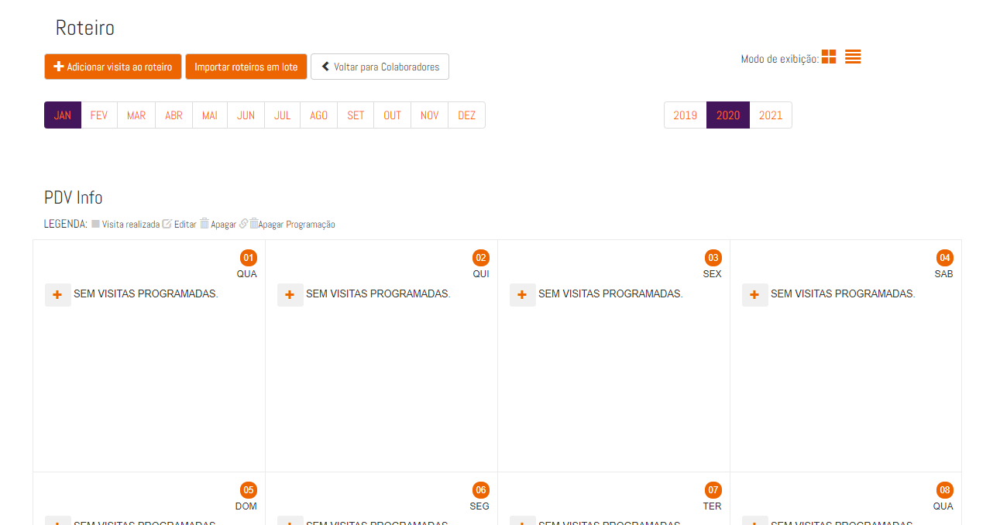
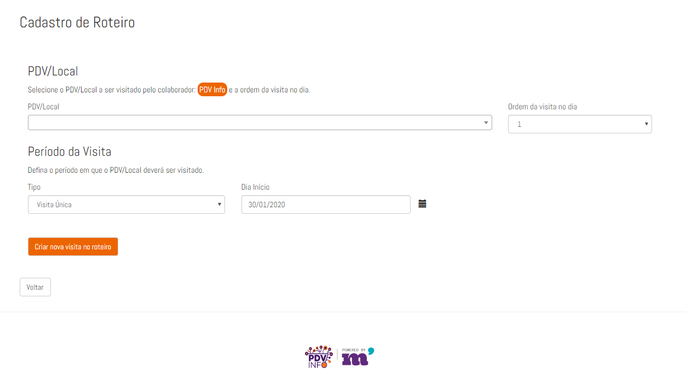
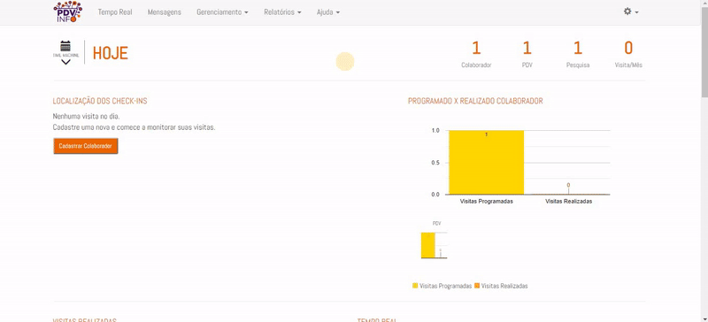
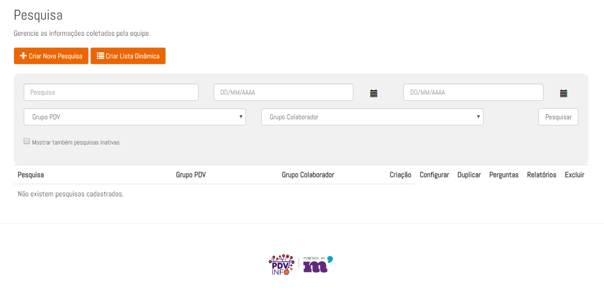
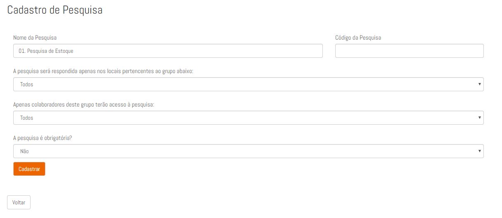
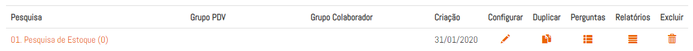
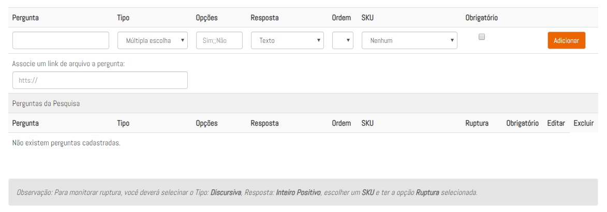

# Primeiros Passos

Nesta seção, você encontrará um guia geral para se ambientar na plataforma, seja no painel ou no aplicativo.
De forma geral, a gestão se dá a partir de uma boa organização do painel e um entendimento de como configura-lo.
O painel de gestão se comunica diretamente com o aplicativo, ou seja, o roteiro do colaborador, as pesquisas cadastradas,
o endereço do Ponto de Venda, tem que ser cadastrados de forma correta. Por isso devemos entender o funcionamento geral
da ferramenta.

### 1. Cadastro do Colaborador  

Para cadastro de um novo colaborador entre em **Gerenciamento > Colaborador** . Clique em Novo Colaborador
e preencha os campos de cadastro.

* `Nome` - O nome do colaborador. *
* `CPF` - O CPF do colaborador. 
* `E-mail` - Email do colaborador. *
* `Telefone` - Telefone do colaborador, DD + Número.
* `Username` - Username é o nome de usuário que dá acesso ao App do colaborador. *
* `Password` - É a senha de acesso ao App do colaborador. *

 

#### 1.1 Controle de Expediente
O controle de expediente pode ser utilizado para bloquear o aplicativo quando o colaborador estiver fora dos horários estabelecidos.  

#### 1.2 Tipo de Monitoramento do Celular
Para configurar o tipo de rastreamento do posicionamento por GPS do promotor. 

* `Padrão` - Os dados de posicionamento serão gravados apenas no momento do check-in e check-out.
* `Fulltime` - O colaborador será rastreado dentro e fora do ponto. A posição é atualizada a cada 5 minutos.

### 2. Cadastro de PDV

O cadastro de PDV é feito através de **Gerenciamento > PDV > Adicionar Novo PDV **. Quanto mais completo o cadastro mais preciso será o ponto no mapa. Em casos de pontos sem número, recomenda-se utilizar a Latitude e a Logitude.

### 3. Criação de um Roteiro ou Carteira

O roteiro ou carteira é como os PDV's são relacionados ao colaborador. A diferença entre um roteiro e a carteira é que o roteiro tem como objetivo seguir um calendário de visitas, que podem ser configuradas em vários períodos de repetição. Já na carteira, os PDV's ficam atribuídos ao colaborador, que pode acessar e realizar suas visitas através da função "Buscar" no App.

#### 3.1 Configuração de Roteiro

Em **Gerenciamento > Roteiro** ficam dispostos os colaboradores cadastrados. Clicando no colaborador que 
terá um roteiro cadastrado leva à pagina com o calendário do mês:

 
 
Em **adicionar visita ao roteiro**, a visita pode ser cadastrada:
 

Selecione um PDV e configure o período.

##### 3.1.1 Períodos de repetição da visita

* `Visita Única` - Será uma visita ao PDV que só será feita em um dia.
* `Diária` - Esta visita se repetirá todos os dias da semana durante um período selecionado. Podem ser adicionados sábados e domingos.
* `Semanal` - É um roteiro que se repete baseado nos dias da semana dentro de um período.
* `A cada 2 semanas` - A cada duas semanas, esse roteiro se repete. Por exemplo: Ao selecionar uma segunda-feira num mês, em 15 dias (Próxima segunda-feira em duas semanas) a visita será disponibilizada ao colaborador.
* `A cada 3 semanas` - A cada três semanas, esse roteiro se repete. Por exemplo: Ao selecionar uma segunda-feira num mês, em 22 dias (Próxima segunda-feira em três semanas) a visita será disponibilizada ao
colaborador.  
* `Mensal` - Todo mês, a visita vai se repetir no dia especificado.
* `Bimestral` - A cada dois meses, a visita vai se repetir no dia especificado.
* `Trimestral` - A cada três meses, a visita vai se repetir no dia especificado.
* `Semestral` - A cada seis meses, a visita vai se repetir no dia especificado.      
* `Anual` - A visita será realizada por ano.

##### 3.1.2 Exemplo de um Roteiro

O colaborador fará uma visitação semanal todas as segundas, quartas, sextas e sábados em um PDV.
Para isso, vamos utilizar o tipo de visita semanal. Marcar os dias da semana e selecionar um período.

#### 3.2 Registro de Carteira

A configuração de uma carteira é mais simples que a de roteiro. Em **Gerenciamento > Carteira**, são adicionados os PDV's cadastrados no painel à carteira do promotor.

### 4. Pesquisa

A criação de uma pesquisa e perguntas é a parte final de uma configuração básica do painel.

Em **Gerenciamento > Pesquisa**, todas as configurações de pesquisa estão disponíveis. Clique em **Criar Nova Pesquisa**  para adicionar uma nova pesquisa.

Insira um nome e clique em cadastrar. O código de pesquisa não é obrigatório.

Para configuração de Grupos, siga para a página ** LINK PÁGINA GRUPOS ** 

Com a pesquisa cadastrada, é necessário cadastrar as perguntas. Clique na pesquisa criada para entrar na configuração das perguntas. 

Aqui, estão dispostas todas as perguntas para essa pesquisa. 

##### 4.1 Tipos de pergunta

* `Multipla Escolha` - Será apresentado ao colaborador várias opções de resposta, podendo selecionar uma delas para responder à pergunta. As opções são dadas no campo **Opções** separado por **" ;; "** (Dois ponto e vírgula).
* `Discursiva` - O colaborador insere os dados por meio do teclado. Estes dados podem ser filtrados pelo tipo de resposta.

* `Upload de Imagem` - Será aberta a camera do dispostivo, possibilitando a captura de uma imagem. Só imagens tiradas naquele instante seram aceitas, ou seja, não é possível enviar fotos da galeria.

* `Lista Dinâmica` - Uma versão da multipla escolha que suporta muito mais itens.

##### Tipos de Respostas

* `Texto` - O teclado do dispositivo será aberto possibilitando a entrada de dados do tipo texto.

* `Inteiro Positivo` - Um teclado numérico será aberto para inserir números inteiros. Quantidade de estoque por exemplo, é verificada com esse tipo de resposta.

* `Decimal Positivo` - Entrada de números decimais, utilizada por exemplo para preço de um determinado produto.

##### Ordem

A ordem é o que dita quais perguntas aparecem primeiro no aplicativo.
É importante pois dá o sentido do questionário.

### 5. Utilizando o Aplicativo

Após a configuração básica do painel, o aplicativo já pode ser utilizado. Para isso,
acesse a Google Play Store clicando [aqui](https://play.google.com/store/apps/details?id=br.com.movindigital.apps.pdv_info&hl=pt_BR) ou pesquisando no aplicativo da loja
por "PDV Info".

Ao abrir o aplicativo, será aberta a tela de login. Esse login é o criado dentro do painel, em "Colaboradores".

Após entrar na conta, será apresentada a tela inicial, com o nome da ação no topo.

