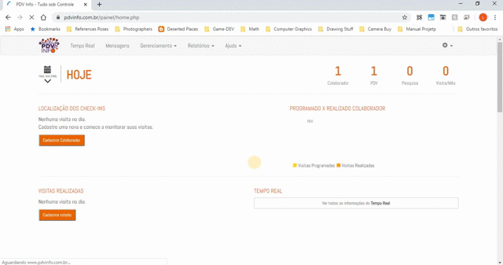

# Primeiros Passos

Nesta seção, você encontrará um guia geral para se ambientar na plataforma, seja no painel ou no aplicativo.
De forma geral, a gestão se dá a partir de uma boa organização do painel e um entendimento de como configura-lo.
O painel de gestão se comunica diretamente com o aplicativo, ou seja, o roteiro do colaborador, as pesquisas cadastradas,
o endereço do Ponto de Venda, tem que ser cadastrados de forma correta. Por isso devemos entender o funcionamento geral
da ferramenta.

### 1. Cadastro do Colaborador  

Para cadastro de um novo colaborador entre em **Gerenciamento > Colaborador** . Clique em Novo Colaborador
e preencha os campos de cadastro.

* `Nome` - O nome do colaborador. *
* `CPF` - O CPF do colaborador. 
* `E-mail` - Email do colaborador. *
* `Telefone` - Telefone do colaborador, DD + Número.
* `Username` - Username é o nome de usuário que dá acesso ao App do colaborador. *
* `Password` - É a senha de acesso ao App do colaborador. *

## 

### 
