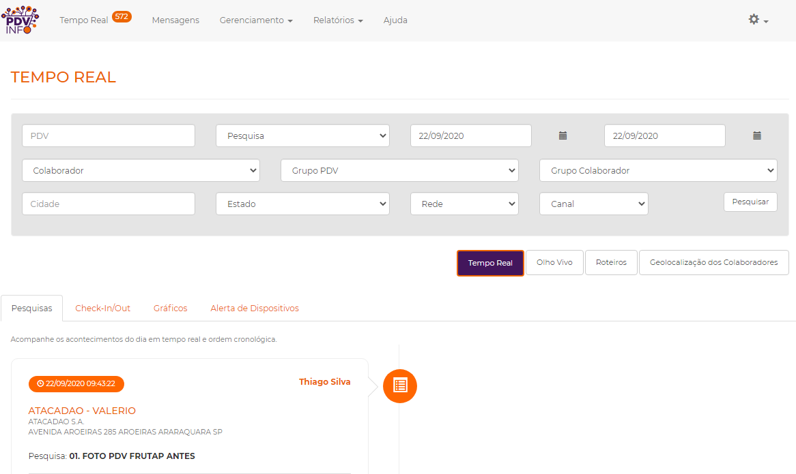
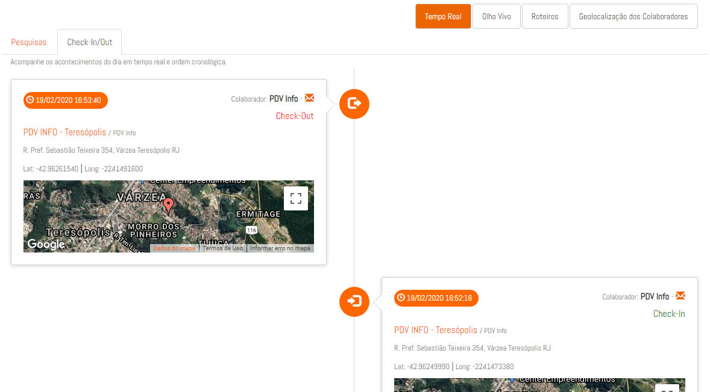
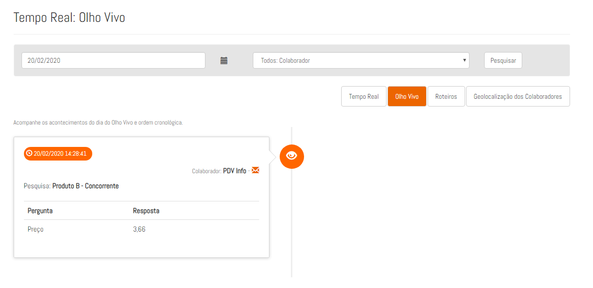
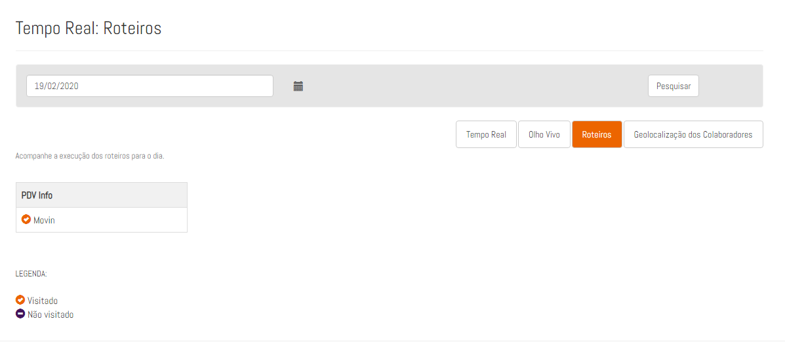

### 1. O que é:

O Tempo Real é a página que consolida os dados vindo dos colaboradores em campo. Esses dados são apresentados em tempo real
assim que são enviados do app do promotor. 

No campo de filtros você tem várias opções de como organizar os dados dispostos no feed. Você pode até selecionar períodos anteriores ao 
dia atual. 

 

#### 2. Check-in/Out 

Em Check-in/Out estão dispostas as informações sobre as entradas nos PDV's pelos colaboradores. Junto com um mapa mostrando a localização do mesmo no momento em que realizou a ação.

 

#### 3. Olho Vivo

Em Olho Vivo, todos os produtos cadastrados que serão monitorados pelos colaboradores aparecem aqui, incluindo as respostas dadas.

 

#### 4. Roteiro

Em roteiro, você terá uma visão dos roteiros naquele dia dos promotores, com os pontos que foram visitados e que ainda não foram.

 

#### 5. Geolocalização dos Colaboradores

Se a opção de [rastreamento Full-time](primeiros-passos.md#12-tipo-de-monitoramento-do-celular) do colaborador estiver ligada, as informações do possionamento em tempo real dele apareceram neste mapa.

